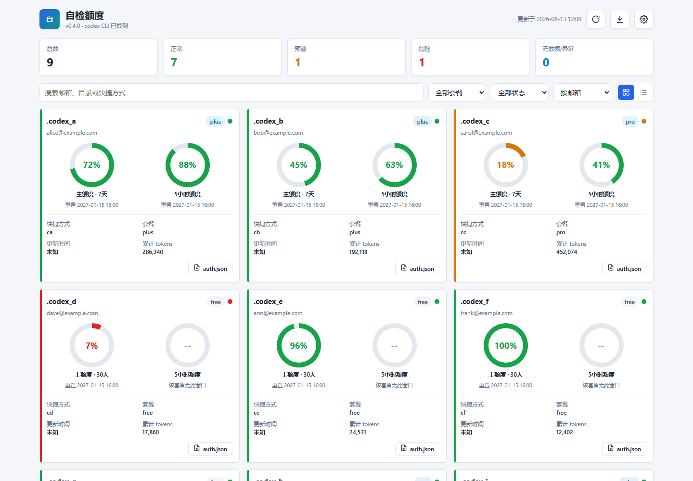
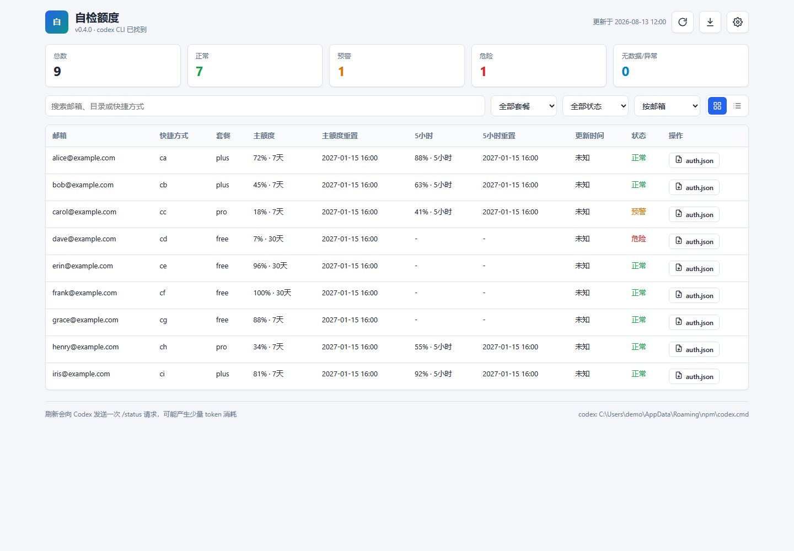

# 自检额度

一个 Windows 桌面客户端，自动扫描本机所有 Codex 账号，展示套餐、剩余额度和重置时间，支持一键刷新、打开 `auth.json`、导出 CSV / XLSX / JSON。





## 下载使用

从 [Releases](https://github.com/sheyingxin1204/QuotaSelfCheck/releases) 下载：

- `QuotaSelfCheck-Setup.exe`：安装版，安装后自动创建桌面快捷方式，推荐大多数用户使用。
- `QuotaSelfCheck.exe`：绿色单文件，下载后双击即可运行，适合便携使用。

两种版本都不需要安装 Python 或 Excel。

## 功能

- 自动发现本机所有 Codex 账号目录，包括默认目录、`.codex*` 系列目录和 shell 快捷方式。
- 展示账号邮箱、套餐、主额度剩余、额度重置时间、累计 token。
- 同一登录账号的多个本地目录会自动合并展示，并保留关联目录入口，避免重复计数。
- 卡片和表格两种视图，支持搜索、筛选、排序。
- 手动刷新额度，刷新会调用 Codex 的 `/status` 请求，有少量 token 消耗。
- 支持单个账号单独刷新，不用每次全量刷新所有账号。
- 额度低于设定阈值时弹出系统提醒，界面也会常驻显示低额度横幅。
- 启动时自动检查 GitHub 新版本，发现新版会在界面提示。
- 关闭窗口时最小化到系统托盘，可随时从托盘恢复或退出。
- 每个账号可以一键打开它的 `auth.json`。
- 导出 CSV / XLSX / JSON 报告到指定目录。
- 一键打开报告导出目录。
- 内置环境诊断页，可查看 codex CLI、账号发现、刷新记录和配置信息。
- 设置面板可以添加额外 Codex 目录、关闭启动自动刷新、修改导出目录。

## 安全说明

- 程序只读取本机 Codex 的本地文件，不会上传任何邮箱、token、会话或账号数据。
- 内置 Web 服务只监听 `127.0.0.1`，不会暴露到局域网。
- 刷新额度时才向 Codex 官方接口发送 `/status` 请求，除此之外没有其他网络请求。

## 代码签名

当前发布版本未使用正式代码签名证书，Windows SmartScreen 可能在首次运行时提示“未知发布者”，点击“仍要运行”即可。要消除该提示，需要购买代码签名证书（例如 DigiCert / Sectigo，或微软 Azure Trusted Signing）后使用 `scripts\sign.ps1` 对 exe 签名。

```powershell
.\scripts\sign.ps1 -ExePath dist\QuotaSelfCheck.exe -Thumbprint <证书指纹>
```

自签名证书只能让文件带上签名信息，Windows 仍然不认识发布者，无法消除 SmartScreen 提示。

## 常见问题

### 第一次启动有点慢

绿色单文件版启动时需要先解压到临时目录，第一次会比之后慢几秒。安装版使用目录模式，启动更快。

### 提示没有额度数据

程序需要电脑上已经登录过 Codex 账号并产生过会话记录。如果账号从未运行过，或没有安装 codex CLI，会显示“无数据”。

### 刷新额度消耗 token 吗

会。每次点“刷新”都会向 Codex 发送一次 `/status` 请求，消耗少量 token。可以关闭“启动时自动刷新”，只在需要时手动刷新。

## 开源协作

仓库是公开只读的：任何人都可以查看代码，但不会被授予直接推送权限。外部贡献请通过 fork 后提交 Pull Request，所有合并由仓库维护者审阅后完成。本项目使用 [MIT License](LICENSE)。

## 开发者构建

源码目录 `quota_check/` 是客户端核心模块。

构建绿色单文件版并创建桌面快捷方式：

```powershell
.\build_exe.ps1
```

系统安装了 [UPX](https://github.com/upx/upx) 时，PyInstaller 会自动用它压缩部分二进制，减小单文件体积；没有 UPX 也不影响构建。

构建安装版（需要 Inno Setup 6）：

```powershell
.\scripts\build_setup.ps1
```

构建产物在 `dist\`：

- `QuotaSelfCheck.exe`：绿色单文件版
- `QuotaSelfCheck\`：目录版，安装包使用的源
- `QuotaSelfCheck-Setup.exe`：安装版

## 已知边界

- 额度数据来自 Codex 写入的 `token_count` 事件，字段结构由 Codex 决定，解析器对多种字段形态做了兼容。
- 当前发布版是 Windows 客户端，需要 Win10 / Win11，并具备 WebView2 运行时（系统一般自带）。
